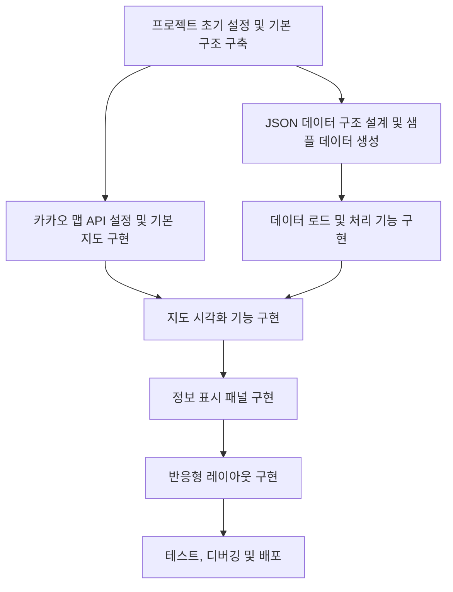
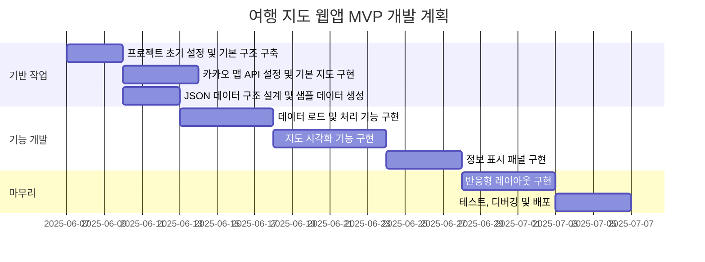
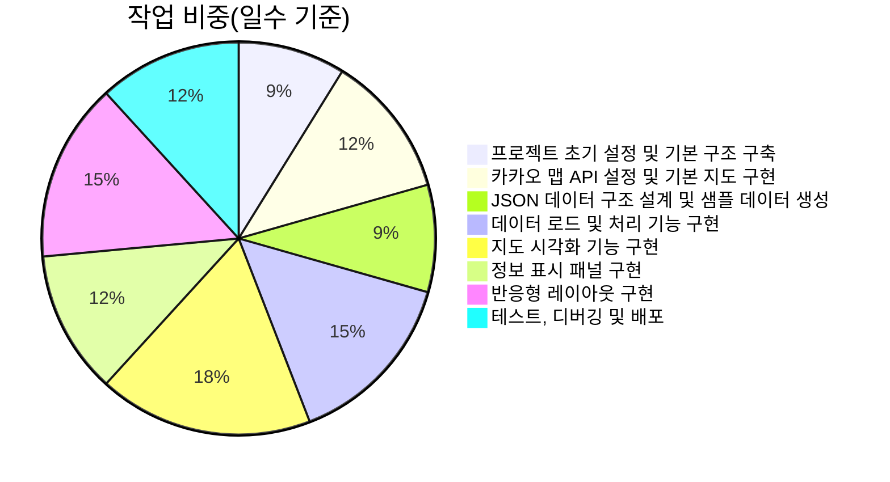

# 여행 지도 웹앱 MVP 개발 계획서

## 개요

이 문서는 제주도 여행을 위한 여행지도 웹앱의 1단계 MVP(Minimum Viable Product) 개발 계획을 담고 있습니다. 요구사항 정의서를 기반으로 HTML, JavaScript, CSS를 사용하여 GitHub Pages에 배포 가능한 최소 기능 웹앱을 구현하는 것을 목표로 합니다.

## 주요 개발 목표

- 카카오 맵 API 통합 및 기본 지도 표시
- JSON 형식의 데이터 구조 설계 및 샘플 데이터 생성
- 구글 드라이브에서 데이터 파일 로드 기능
- 데이터를 지도에 마커로 표시하는 기능
- 마커 클릭 시 기본 정보 표시
- 반응형 레이아웃 기초 구현

## 작업 계획 개요

### 작업 의존성 다이어그램

### 작업 일정 간트 차트

### 작업 비중 파이 차트

## 세부 작업 계획

### 1. 프로젝트 초기 설정 및 기본 구조 구축

**설명:** GitHub 저장소 생성, 기본 디렉토리 구조 설정, HTML/CSS/JS 파일 구성, GitHub Pages 배포 설정을 포함한 프로젝트의 기본 뼈대를 구축합니다.

**구현 가이드:**
1. GitHub 저장소 생성
2. 다음과 같은 디렉토리 구조 설정:
   - index.html (메인 페이지)
   - css/ (스타일시트 폴더)
     - style.css (기본 스타일)
     - responsive.css (반응형 스타일)
   - js/ (자바스크립트 폴더)
     - map.js (지도 관련 기능)
     - data.js (데이터 처리 기능)
     - ui.js (UI 조작 기능)
   - data/ (샘플 데이터 폴더)
     - sample.json (샘플 데이터)
3. 기본 HTML 템플릿 작성 (지도 컨테이너, 사이드 패널 등)
4. 기본 CSS 스타일 적용
5. GitHub Pages 배포 설정

**참고 사항:** 프로젝트의 기본 구조는 확장성을 고려하여 구성하며, 향후 React 전환을 위한 모듈화된 구조로 설계합니다.

**검증 기준:**
- GitHub 저장소가 생성되었는지 확인
- 기본 디렉토리 구조가 올바르게 설정되었는지 확인
- index.html이 기본 레이아웃을 포함하고 있는지 확인
- CSS 파일이 기본 스타일을 제공하는지 확인
- GitHub Pages에서 기본 페이지가 정상적으로 표시되는지 확인

### 2. 카카오 맵 API 설정 및 기본 지도 구현

**설명:** 카카오 개발자 계정 등록, API 키 발급, 기본 지도 표시 기능 구현, 지도 컨트롤 및 기본 기능을 구현합니다.

**구현 가이드:**
1. 카카오 개발자 계정 가입 및 애플리케이션 등록
2. JavaScript API 키 발급
3. index.html에 카카오 맵 API 스크립트 추가
4. js/map.js에 다음 기능 구현:
   - 지도 초기화 함수
   - 기본 지도 옵션 설정 (중심 좌표, 확대 레벨 등)
   - 지도 컨트롤 추가 (줌, 타입 변경 등)
   - 지도 이벤트 리스너 설정
5. 지도가 화면에 꽉 차도록 CSS 스타일 적용

**참고 사항:** 카카오 맵 API의 일일 사용량 제한을 고려하여 개발 단계에서는 효율적으로 사용해야 합니다. 지도 초기화 로직은 모듈화하여 향후 확장성을 고려합니다.

**검증 기준:**
- 카카오 맵이 웹페이지에 정상적으로 로드되는지 확인
- 지도 컨트롤이 정상적으로 작동하는지 확인
- 지도가 반응형으로 화면 크기에 맞게 조정되는지 확인
- 개발자 도구에서 콘솔 오류가 없는지 확인

### 3. JSON 데이터 구조 설계 및 샘플 데이터 생성

**설명:** 장소, 테마, 여행 일정에 대한 JSON 데이터 구조를 설계하고, 애플리케이션 테스트에 사용할 샘플 데이터를 생성합니다.

**구현 가이드:**
1. 요구사항에 맞는 데이터 스키마 설계:
   - 장소 데이터: 이름, URL, 위치정보(위도/경도), 주소, 설명, 라벨 등
   - 테마 데이터: 테마 이름, 설명, 포함된 장소 목록, 생성/수정 날짜, 카테고리 등
   - 여행 일정 데이터: 제목, 기간, 일자별 방문 장소, 메모 등
2. 다음 샘플 데이터 파일 생성:
   - data/places.json: 다양한 장소 데이터
   - data/themes.json: 테마별 지도 데이터
   - data/trips.json: 여행 일정 데이터
3. 데이터 유효성 검증 로직 구현

**참고 사항:** 데이터 구조는 향후 확장성을 고려하여 설계하며, 샘플 데이터는 실제 사용 사례를 반영해야 합니다. 데이터 검증 로직은 사용자 입력 오류를 방지하기 위해 중요합니다.

**검증 기준:**
- JSON 스키마가 요구사항에 맞게 설계되었는지 확인
- 샘플 데이터가 유효한 JSON 형식인지 확인
- 샘플 데이터가 다양한 사용 사례를 포함하는지 확인
- 데이터 유효성 검증 로직이 올바르게 작동하는지 확인

### 4. 데이터 로드 및 처리 기능 구현

**설명:** 로컬 JSON 파일 및 구글 드라이브에서 데이터를 로드하고 파싱하는 기능을 구현합니다. 데이터를 내부 형식으로 변환하고 애플리케이션에서 사용할 수 있도록 처리합니다.

**구현 가이드:**
1. 로컬 JSON 파일 로드 기능 구현:
   - fetch API를 사용한 비동기 데이터 로드
   - JSON 파싱 및 데이터 검증
2. 구글 드라이브 API 연동:
   - 구글 개발자 콘솔에서 프로젝트 설정 및 API 키 발급
   - 구글 드라이브 API 클라이언트 라이브러리 통합
   - 파일 선택 및 로드 UI 구현
3. 데이터 변환 및 처리 로직 구현:
   - 로드된 데이터를 내부 형식으로 변환
   - 데이터 캐싱 및 메모리 관리
4. 오류 처리 및 로딩 상태 표시 구현

**참고 사항:** 데이터 로드 과정에서 발생할 수 있는 오류를 적절히 처리하고 사용자에게 피드백을 제공해야 합니다. 큰 데이터 파일을 효율적으로 처리할 수 있는 방법을 고려해야 합니다.

**검증 기준:**
- 로컬 JSON 파일이 정상적으로 로드되는지 확인
- 구글 드라이브에서 파일을 선택하고 로드할 수 있는지 확인
- 잘못된 형식의 데이터를 로드할 때 적절한 오류 처리가 이루어지는지 확인
- 로딩 상태가 사용자에게 적절히 표시되는지 확인

### 5. 지도 시각화 기능 구현

**설명:** 로드된 데이터를 기반으로 지도에 마커를 표시하고, 마커 스타일링 및 클러스터링 기능을 구현합니다. 다양한 테마와 카테고리에 따라 마커를 필터링하는 기능도 포함합니다.

**구현 가이드:**
1. 마커 생성 및 표시 기능 구현:
   - 장소 데이터를 기반으로 카카오 맵 마커 생성
   - 마커 위치 및 속성 설정
2. 마커 스타일링 구현:
   - 카테고리별 다른 아이콘 적용
   - 마커 색상 및 크기 커스터마이징
3. 마커 이벤트 처리:
   - 마커 클릭 이벤트 리스너 설정
   - 마커 호버 효과 구현
4. 테마 및 카테고리별 필터링 기능 구현:
   - 선택된 테마에 따라 마커 표시/숨김 처리
   - 카테고리 필터링 UI 및 로직 구현

**참고 사항:** 지도에 많은 마커가 표시될 경우 성능 이슈가 발생할 수 있으므로, 효율적인 마커 관리 방법을 고려해야 합니다. 사용자 경험을 위해 마커 표시 및 숨김 시 애니메이션 효과를 적용하는 것이 좋습니다.

**검증 기준:**
- 장소 데이터가 지도에 마커로 정확히 표시되는지 확인
- 마커 클릭 시 이벤트가 정상적으로 발생하는지 확인
- 테마 및 카테고리별 필터링이 정상적으로 작동하는지 확인
- 많은 마커가 있을 때도 성능이 유지되는지 확인

### 6. 정보 표시 패널 구현

**설명:** 마커 클릭 시 표시되는 정보 패널을 구현합니다. 장소 상세 정보, 이미지, 링크 등을 표시하고, 접이식 패널 기능을 구현합니다.

**구현 가이드:**
1. 정보 패널 UI 구현:
   - HTML 구조 설계 (제목, 설명, 이미지, 링크 등)
   - CSS 스타일링 및 애니메이션 효과
2. 마커 클릭 시 정보 패널 표시 기능 구현:
   - 마커 클릭 이벤트와 정보 패널 연결
   - 선택된 장소 데이터 표시 로직
3. 접이식 패널 기능 구현:
   - 패널 열기/닫기 토글 버튼
   - 슬라이딩 애니메이션 효과
4. 정보 패널 내 콘텐츠 레이아웃 구현:
   - 이미지 갤러리 (있을 경우)
   - 외부 링크 (네이버 지도, 카카오 지도 등)
   - 장소 설명 및 태그 표시

**참고 사항:** 정보 패널은 사용자 경험의 핵심 요소이므로, 직관적이고 반응성이 좋은 UI를 구현해야 합니다. 모바일 화면에서도 잘 작동하도록 설계해야 합니다.

**검증 기준:**
- 마커 클릭 시 정보 패널이 정상적으로 표시되는지 확인
- 정보 패널에 장소 데이터가 올바르게 표시되는지 확인
- 접이식 패널이 부드럽게 열리고 닫히는지 확인
- 모바일 화면에서도 정보 패널이 잘 표시되는지 확인

### 7. 반응형 레이아웃 구현

**설명:** 모바일, 태블릿, 데스크톱 등 다양한 화면 크기에 최적화된 반응형 레이아웃을 구현합니다. 미디어 쿼리를 사용하여 화면 크기에 따라 UI 요소를 조정합니다.

**구현 가이드:**
1. 반응형 설계 원칙 적용:
   - 모바일 우선(Mobile First) 접근법 사용
   - 유동적인 그리드 레이아웃 적용
2. 미디어 쿼리 구현:
   - 모바일 기본 스타일 정의
   - 태블릿 중단점 (768px) 스타일 정의
   - 데스크톱 중단점 (1024px) 스타일 정의
3. 반응형 UI 요소 구현:
   - 모바일에서는 하단에서 올라오는 형태의 정보 패널
   - 태블릿/데스크톱에서는 측면에 표시되는 정보 패널
   - 화면 크기에 따른 버튼 및 컨트롤 크기 조정
4. 터치 인터랙션 지원:
   - 모바일 장치를 위한 터치 제스처 구현
   - 스와이프 내비게이션 구현

**참고 사항:** 반응형 레이아웃은 사용자 경험의 핵심 요소이므로, 다양한 장치에서 테스트하여 최적의 경험을 제공해야 합니다. 성능을 고려하여 최적화된 CSS 및 미디어 쿼리를 작성해야 합니다.

**검증 기준:**
- 다양한 화면 크기에서 레이아웃이 적절히 조정되는지 확인
- 모바일 장치에서 터치 인터랙션이 정상적으로 작동하는지 확인
- 정보 패널이 화면 크기에 따라 적절히 표시되는지 확인
- 성능 이슈 없이 화면 크기 변경이 부드럽게 처리되는지 확인

### 8. 테스트, 디버깅 및 배포

**설명:** 구현된 기능들을 테스트하고 디버깅한 후, GitHub Pages에 배포합니다. 크로스 브라우저 테스트, 성능 최적화, 사용자 경험 개선 작업을 수행합니다.

**구현 가이드:**
1. 테스트 계획 수립 및 실행:
   - 기능별 테스트 케이스 작성
   - 크로스 브라우저 테스트 (Chrome, Firefox, Safari, Edge)
   - 다양한 장치 및 화면 크기 테스트
2. 디버깅 및 이슈 해결:
   - 콘솔 오류 및 경고 확인 및 수정
   - 성능 병목 현상 식별 및 최적화
   - 사용자 경험 개선점 식별 및 수정
3. 코드 최적화:
   - JavaScript 코드 정리 및 최적화
   - CSS 최적화 및 중복 제거
   - 이미지 및 리소스 최적화
4. GitHub Pages 배포:
   - 배포 스크립트 작성
   - 배포 테스트 및 확인
5. 기본 사용법 문서 작성:
   - README.md 업데이트
   - 간단한 사용자 가이드 작성

**참고 사항:** 테스트 과정에서 발견된 모든 이슈는 즉시 해결하고, 사용자 피드백을 반영하여 지속적으로 개선해야 합니다. 배포 전 최종 검토를 통해 모든 기능이 정상적으로 작동하는지 확인해야 합니다.

**검증 기준:**
- 모든 기능이 다양한 브라우저에서 정상적으로 작동하는지 확인
- 콘솔 오류 및 경고가 없는지 확인
- 성능이 최적화되었는지 확인 (로딩 시간, 상호작용 응답성 등)
- GitHub Pages에서 애플리케이션이 정상적으로 배포되었는지 확인
- README.md가 프로젝트를 적절히 설명하고 있는지 확인

## 결론

이 문서에서 설명한 작업 계획을 따라 여행 지도 웹앱의 1단계 MVP를 개발하면, 사용자가 지도 기반으로 장소를 시각화하고 정보를 확인할 수 있는 기본 기능을 갖춘 웹 애플리케이션을 구현할 수 있습니다. 이후 단계에서는 React와 TypeScript로의 전환, 데이터 관리 기능 추가 등을 통해 애플리케이션을 더욱 발전시킬 수 있습니다.