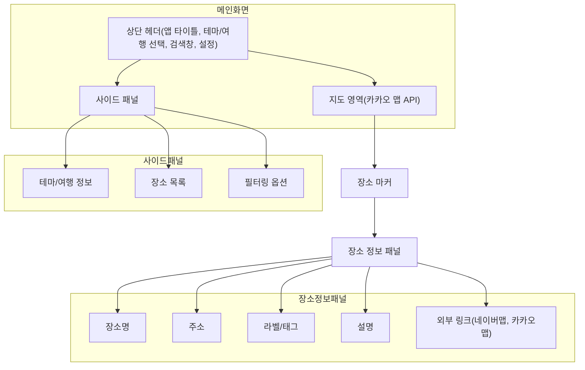
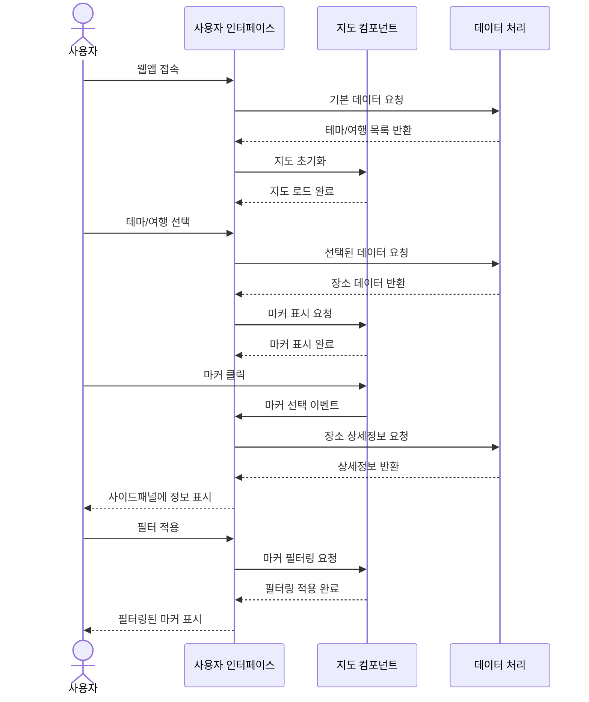
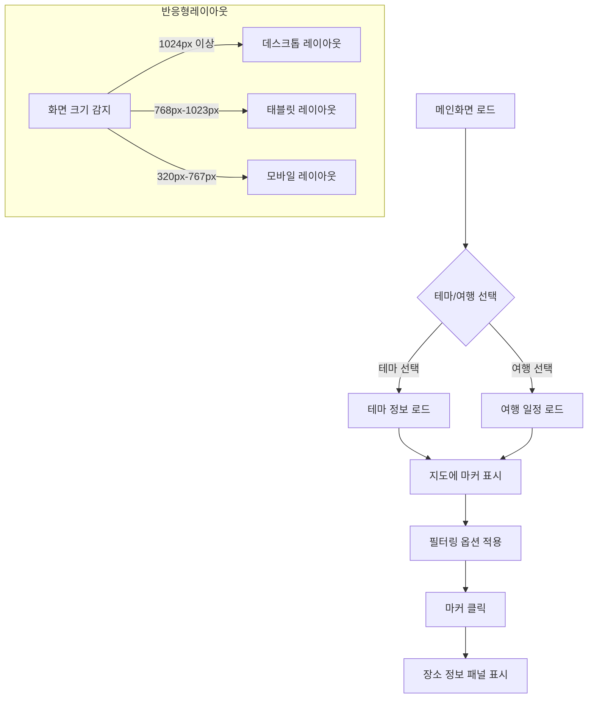
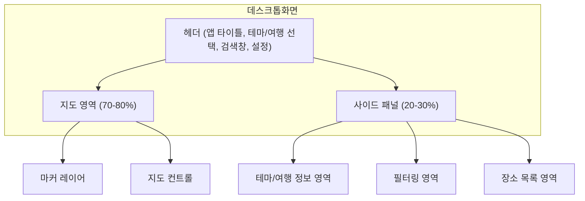
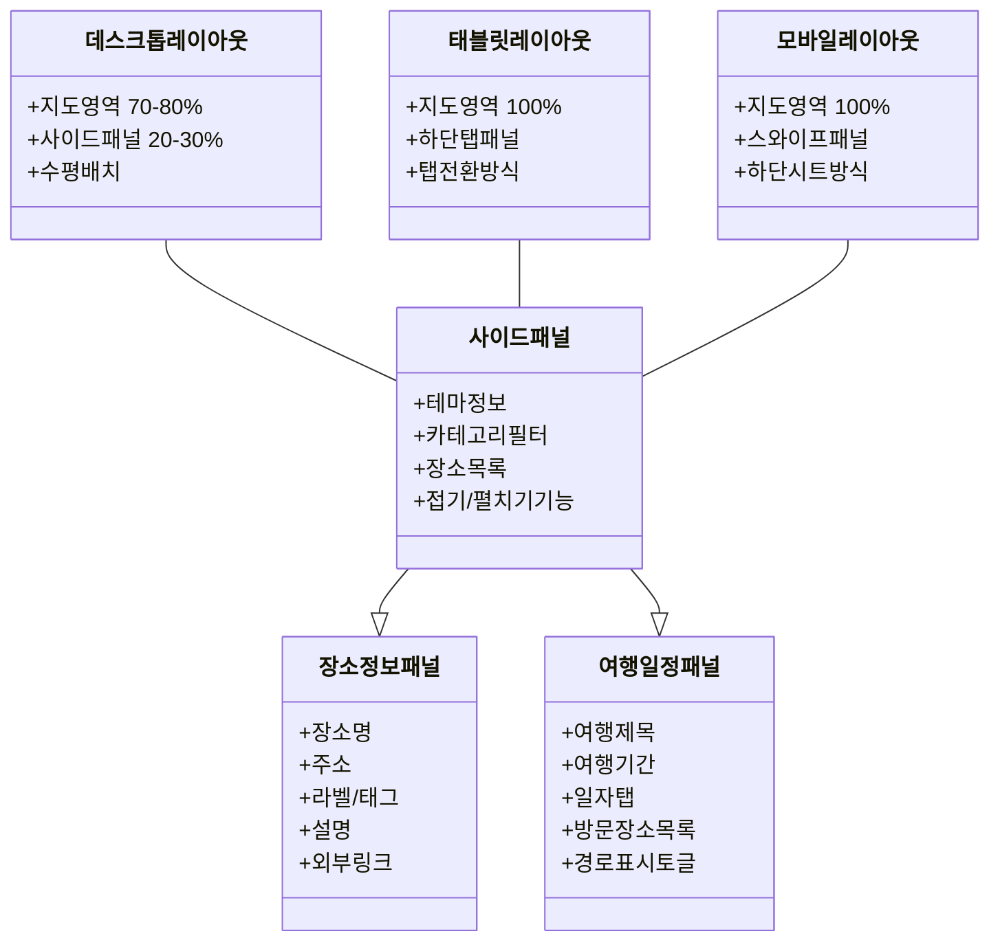
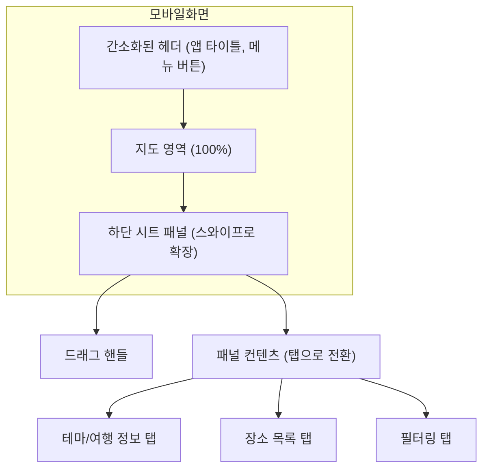
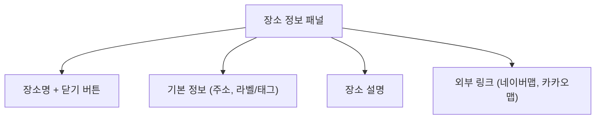
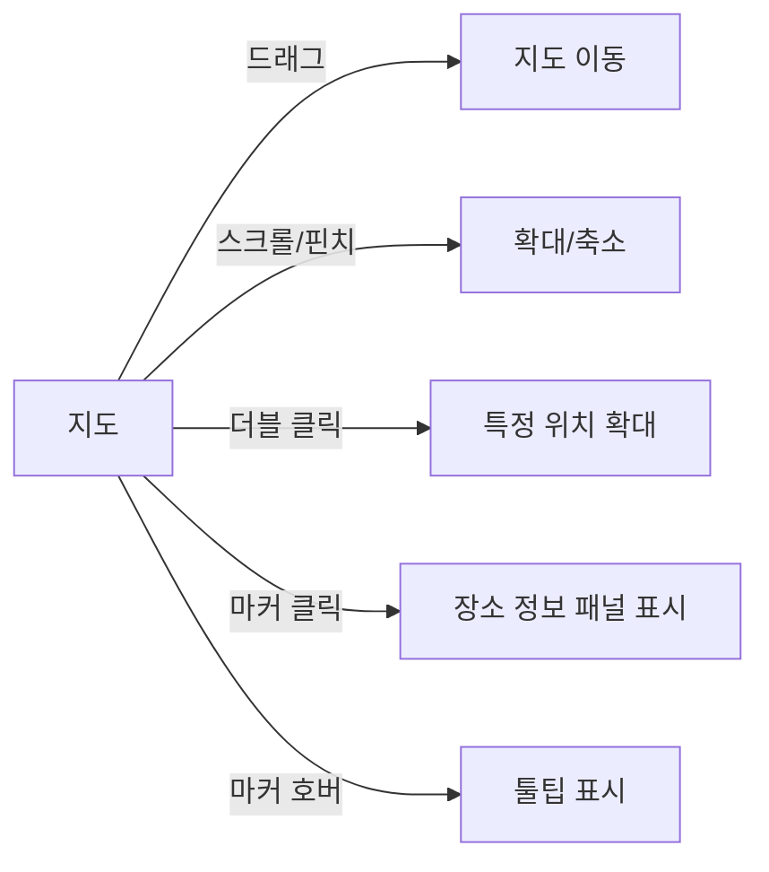
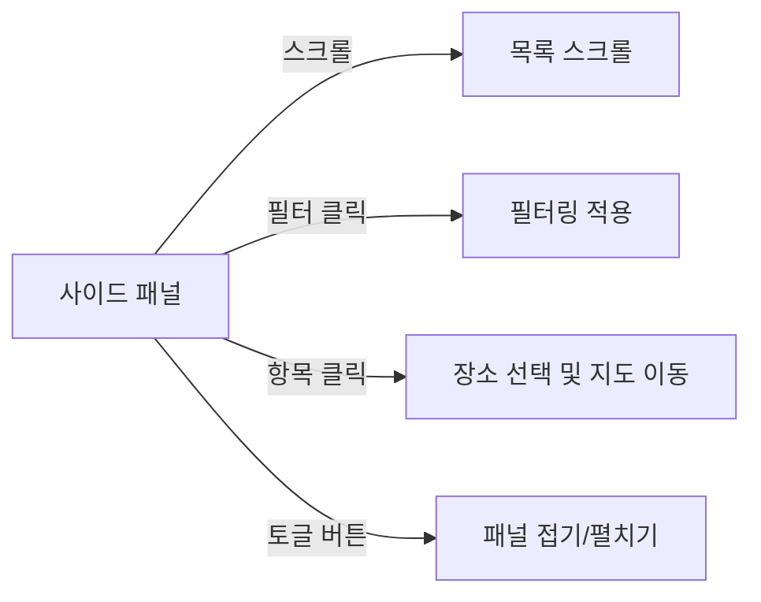
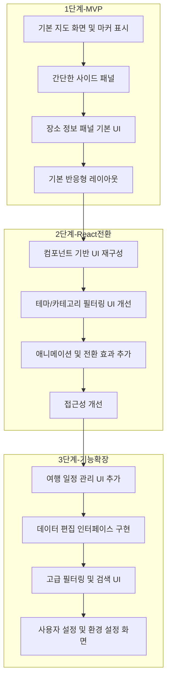

# 여행 지도 웹앱 화면설계서

## 1. 서론

### 1.1. 목적 및 범위
본 문서는 여행 지도 웹앱의 사용자 인터페이스와 사용자 경험을 정의합니다. 이 화면설계서는 HTML, JavaScript, CSS를 이용한 MVP 개발 단계부터 React와 TypeScript로의 전환 및 기능 확장을 고려한 디자인 가이드를 제공합니다.

### 1.2. 주요 사용자 페르소나
- **여행 계획자**: 여행 일정을 지도 기반으로 계획하고 관리하는 사용자
- **맛집 탐방가**: 특정 테마(예: 맛집)의 장소를 탐색하고 기록하는 사용자
- **일반 사용자**: 특정 지역의 장소를 탐색하고 정보를 확인하는 사용자

### 1.3. 디자인 원칙
- **직관성**: 복잡한 기능도 직관적으로 사용할 수 있는 인터페이스
- **일관성**: 모든 화면에서 일관된 디자인 언어 유지
- **반응형**: 다양한 디바이스에서 최적화된 경험 제공
- **효율성**: 최소한의 클릭으로 원하는 정보에 접근 가능

## 2. 화면 구조 개요

### 2.1. 주요 화면 구성

```
┌─────────────────────────────────────────────────┬───────────┐
│                                                 │           │
│                                                 │           │
│                                                 │           │
│                                                 │           │
│                  지도 영역                        │  사이드     │
│                                                 │  패널      │
│                                                 │           │
│                                                 │           │
│                                                 │           │
└─────────────────────────────────────────────────┴───────────┘
```

### 2.2. 화면 흐름도

메인 화면을 중심으로 다양한 상호작용이 이루어지는 구조:

1. 테마/여행 선택 → 지도 마커 업데이트
2. 마커 클릭 → 상세 정보 표시
3. 필터 적용 → 지도 마커 필터링
4. 검색 → 검색 결과 표시 및 해당 위치로 지도 이동



### 2.3. 공통 UI 요소
- **헤더**: 앱 타이틀, 테마/여행 선택 드롭다운, 검색창
- **지도 컨트롤**: 줌 인/아웃, 지도 타입 변경, 현재 위치 표시
- **토글 버튼**: 사이드 패널 접기/펼치기
- **마커**: 장소를 나타내는 지도 위 표시

### 2.4. 사용자 인터랙션 시퀀스



## 3. 화면별 상세 설계



### 3.1. 메인 화면 (데스크톱)

#### 3.1.1. 레이아웃
```
┌───────────────────────────────────────────────────────────────────┐
│ [앱 타이틀]       [테마/여행 선택]       [검색창]        [설정]           │
├───────────────────────────────────────────────────────┬───────────┤
│                                                       │           │
│                                                       │ [테마/여행  │
│                                                       │  정보]     │
│                                                       │           │
│                                                       │           │
│                      지도 영역                          │ [장소 목록] │
│                  (카카오 맵 API)                        │           │
│                                                       │           │
│                                                       │           │
│                                                       │ [필터링    │
│                                                       │  옵션]     │
│                                                       │           │
└───────────────────────────────────────────────────────┴───────────┘
```



#### 3.1.2. 구성 요소
- **지도 영역**: 카카오 맵 API를 사용한 지도 표시 (화면의 70-80% 차지)
- **사이드 패널**: 테마/여행 정보 및 장소 목록 표시 (화면의 20-30% 차지)
  - 접이식 구조로 필요시 확장/축소 가능
- **상단 네비게이션**: 테마/여행 선택, 검색 기능, 설정 메뉴

#### 3.1.3. 인터랙션
- **지도 조작**: 드래그로 이동, 스크롤/버튼으로 확대/축소
- **마커 클릭**: 장소 정보 패널에 정보 표시
- **패널 토글**: 버튼 클릭으로 사이드 패널 접기/펼치기

### 3.2. 사이드 패널 - 테마 정보

#### 3.2.1. 레이아웃
```
┌───────────────┐
│ [테마 제목]     │
│ [테마 설명]     │
├───────────────┤
│ [카테고리 필터]  │
├───────────────┤
│ [장소 목록]     │
│  - 장소 1      │
│  - 장소 2      │
│  - 장소 3      │
│     ...       │
└───────────────┘
```

#### 3.2.2. 구성 요소
- **테마 헤더**: 테마 제목 및 간단한 설명
- **카테고리 필터**: 테마 내 장소 카테고리별 필터링 옵션
- **장소 목록**: 테마에 포함된 장소 리스트 (스크롤 가능)
  - 각 항목: 장소명, 간단 설명, 라벨 표시

#### 3.2.3. 인터랙션
- **필터 선택**: 체크박스로 카테고리 필터 적용/해제
- **장소 항목 클릭**: 해당 장소로 지도 이동 및 정보 표시
- **장소 항목 호버**: 지도에서 해당 마커 강조 표시

### 3.3. 사이드 패널 - 여행 일정

#### 3.3.1. 레이아웃
```
┌───────────────┐
│ [여행 제목]     │
│ [여행 기간]     │
├───────────────┤
│ [일자 탭]       │
├───────────────┤
│ [방문 장소]     │
│  1. 장소 A     │
│  2. 장소 B     │
│  3. 장소 C     │
│     ...       │
└───────────────┘
```

#### 3.3.2. 구성 요소
- **여행 헤더**: 여행 제목 및 기간 표시
- **일자 탭**: 여행 일자별 탭 네비게이션
- **방문 장소 목록**: 해당 일자의 방문 예정 장소 순서대로 표시
  - 각 항목: 순번, 장소명, 방문 시간(옵션)

#### 3.3.3. 인터랙션
- **일자 탭 선택**: 해당 일자의 방문 장소 목록 표시
- **장소 항목 클릭**: 해당 장소로 지도 이동 및 정보 표시
- **경로 표시 토글**: 방문 장소 간 이동 경로 지도에 표시/숨김

### 3.4. 장소 정보 패널

#### 3.4.1. 레이아웃
```
┌───────────────────┐
│ [장소명]         X  │
├───────────────────┤
│ [주소]             │
│ [라벨/태그]         │
├───────────────────┤
│ [설명]             │
│                   │
├───────────────────┤
│ [외부 링크]         │
│ [네이버맵] [카카오맵] │
└───────────────────┘
```

#### 3.4.2. 구성 요소
- **장소 헤더**: 장소명 및 닫기 버튼
- **기본 정보**: 주소, 라벨/태그 목록
- **설명**: 장소에 대한 상세 설명 텍스트
- **외부 링크**: 네이버 지도, 카카오 지도 등 외부 서비스 링크

#### 3.4.3. 인터랙션
- **닫기 버튼**: 정보 패널 닫기
- **외부 링크 클릭**: 해당 서비스로 이동 (새 탭)
- **라벨 클릭**: 해당 라벨을 가진 다른 장소 필터링 (옵션)

## 4. 반응형 디자인 명세



### 4.1. 모바일 레이아웃 (320px~767px)

#### 4.1.1. 메인 화면
```
┌───────────────────┐
│ [앱 타이틀] [메뉴]   │
├───────────────────┤
│                   │
│                   │
│     지도 영역       │
│                   │
│                   │
│                   │
├───────────────────┤
│ [패널 핸들 - 위로 스와이프]│
└───────────────────┘
```



#### 4.1.2. 정보 패널 (스와이프로 표시)
```
┌───────────────────┐
│ [드래그 핸들]        │
├───────────────────┤
│ [테마/여행 정보]     │
│                   │
│ [장소 목록/상세]     │
│                   │
│                   │
└───────────────────┘
```



#### 4.1.3. 인터랙션
- **스와이프 업**: 하단에서 정보 패널 올리기
- **스와이프 다운**: 정보 패널 내리기
- **탭 메뉴**: 콤팩트한 상단 메뉴 사용

### 4.2. 태블릿 레이아웃 (768px~1023px)

#### 4.2.1. 메인 화면
```
┌───────────────────────────────────────┐
│ [앱 타이틀] [테마/여행 선택] [검색창]        │
├───────────────────────────────────────┤
│                                       │
│                                       │
│               지도 영역                 │
│                                       │
│                                       │
│                                       │
├───────────────────────────────────────┤
│ [탭 네비게이션 - 테마/장소/필터]             │
└───────────────────────────────────────┘
```

#### 4.2.2. 컨텐츠 및 구성
- **탭 기반 패널**: 테마/여행 정보, 장소 목록, 필터링 옵션을 탭으로 구분
- **지도 영역**: 전체 화면 너비를 활용하는 대신 높이 조절
- **제한된 헤더**: 핵심 기능만 포함된 간소화된 헤더

#### 4.2.3. 인터랙션
- **탭 전환**: 하단 탭으로 정보 패널 컨텐츠 전환
- **패널 확장**: 필요시 전체 화면 패널로 확장 가능
- **스와이프 동작**: 일부 제스처 지원 (탭 간 스와이프 등)
- **방향 전환**: 가로 모드 지원 (레이아웃 자동 조정)

### 4.3. 데스크톱 레이아웃 (1024px 이상)
- 앞서 설명한 데스크톱 레이아웃 적용
- 화면 크기에 따라 사이드 패널 비율 자동 조정

## 5. 컴포넌트 및 스타일 가이드

### 5.1. 색상 팔레트
- **주요 색상**: #3490dc (파란색 계열)
- **보조 색상**: #38c172 (녹색 계열)
- **강조 색상**: #f6993f (주황색 계열)
- **배경 색상**: #ffffff (흰색), #f8fafc (연한 회색)
- **텍스트 색상**: #2d3748 (진한 회색), #718096 (중간 회색)

### 5.2. 타이포그래피
- **기본 폰트**: 'Noto Sans KR', sans-serif
- **제목 크기**: 
  - H1: 24px (데스크톱) / 20px (모바일)
  - H2: 20px (데스크톱) / 18px (모바일)
  - H3: 18px (데스크톱) / 16px (모바일)
- **본문 크기**: 16px (데스크톱) / 14px (모바일)
- **작은 텍스트**: 14px (데스크톱) / 12px (모바일)

### 5.3. 마커 디자인
- **기본 마커**: 카카오 맵 기본 마커 활용
- **테마별 마커**: 테마에 따른 색상 변화
- **카테고리별 마커**: 카테고리별 아이콘 적용
- **선택된 마커**: 크기 확대 및 강조 효과

### 5.4. 버튼 스타일
- **기본 버튼**: 둥근 모서리, 파란색 배경, 흰색 텍스트
- **보조 버튼**: 테두리만 있는 스타일
- **아이콘 버튼**: 아이콘만 표시, 호버 시 툴팁

## 6. 상호작용 명세

### 6.1. 지도 인터랙션
- **드래그**: 지도 이동
- **스크롤/핀치**: 지도 확대/축소
- **더블 클릭**: 해당 위치로 확대
- **마커 클릭**: 장소 정보 표시
- **마커 호버**: 간단한 정보 툴팁 표시



### 6.2. 패널 인터랙션
- **스크롤**: 장소 목록 스크롤
- **필터 선택**: 체크박스/라디오 버튼으로 필터링
- **항목 클릭**: 해당 장소 선택 및 지도 이동
- **패널 토글**: 버튼으로 패널 접기/펼치기



### 6.3. 애니메이션 및 전환 효과
- **패널 전환**: 슬라이드 애니메이션 (300ms)
- **마커 선택**: 바운스 효과 또는 크기 확대 (200ms)
- **필터 적용**: 마커 페이드 인/아웃 효과 (250ms)
- **모달 표시**: 페이드 인 효과 (200ms)

### 6.4. 오류 상태 및 피드백
- **로딩 상태**: 스피너 또는 스켈레톤 UI 표시
- **오류 메시지**: 모달 또는 토스트 메시지로 표시
- **빈 결과**: 적절한 안내 메시지 및 대체 액션 제공

## 7. 접근성 고려사항

### 7.1. 키보드 네비게이션
- **포커스 순서**: 논리적인 탭 순서 구현
- **키보드 단축키**: 주요 기능에 대한 단축키 제공
- **포커스 표시**: 명확한 포커스 상태 시각화

### 7.2. 스크린 리더 지원
- **대체 텍스트**: 모든 이미지 및 아이콘에 대체 텍스트 제공
- **ARIA 레이블**: 동적 컨텐츠에 적절한 ARIA 속성 적용
- **의미 있는 마크업**: 시맨틱 HTML 요소 사용

### 7.3. 색상 및 가독성
- **색상 대비**: WCAG 2.1 AA 기준 준수 (4.5:1 이상)
- **텍스트 크기**: 최소 12px 이상의 가독성 있는 크기 사용
- **반응형 텍스트**: 화면 크기에 따른 적절한 텍스트 크기 조정

## 8. 구현 우선순위

### 8.1. 1단계 (MVP)
1. 기본 지도 화면 및 마커 표시
2. 간단한 사이드 패널 (접기/펼치기 기능)
3. 장소 정보 패널 기본 UI
4. 모바일/데스크톱 기본 반응형 레이아웃

### 8.2. 2단계 (React 전환)
1. 컴포넌트 기반 UI 재구성
2. 테마/카테고리 필터링 UI 개선
3. 애니메이션 및 전환 효과 추가
4. 접근성 개선

### 8.3. 3단계 (기능 확장)
1. 여행 일정 관리 UI 추가
2. 데이터 편집 인터페이스 구현
3. 고급 필터링 및 검색 UI
4. 사용자 설정 및 환경 설정 화면 

